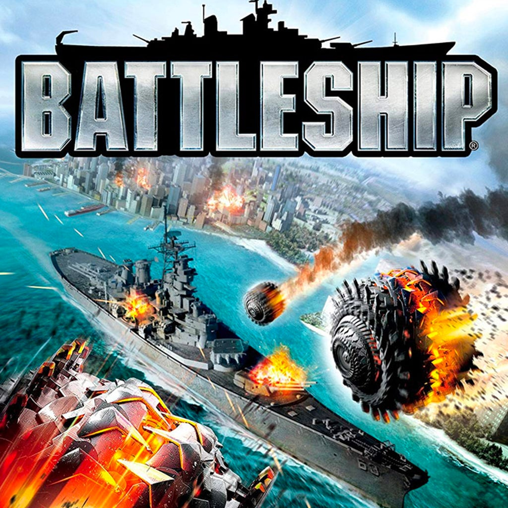
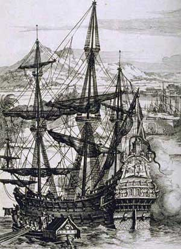
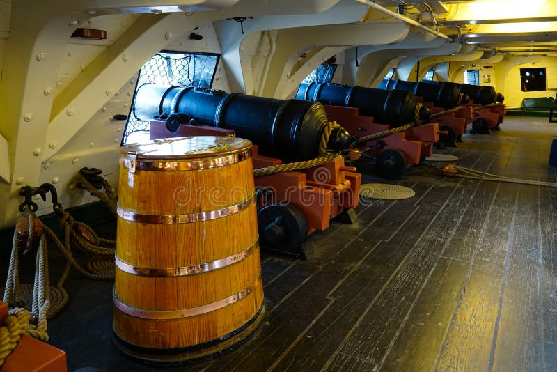
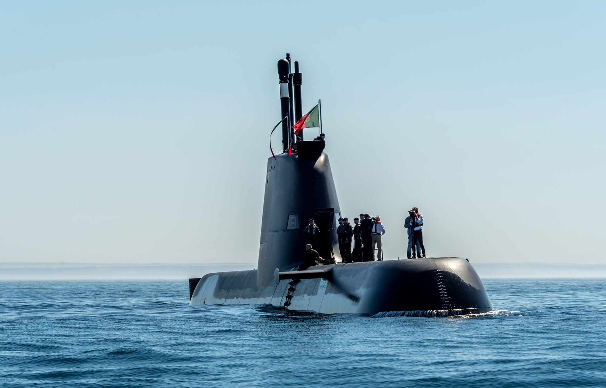

# Battleship

</image>

## Grupo Adamastor
| Curso |    Nome       | Número |
| ---   | ---           | ---    |
| LEI   |José Cardoso   | 124708 |
| LEI   |João Rebelo    | 131056 |
| LEI   | Daniel Santos | 131591 |
| LEI   | Pedro Victor  | 129823 |

## Regras
Cada jogador começa por construir duas grelhas quadriculadas iguais, com dimensões de **10×10**. Uma grelha representa o seu próprio mar e a outra representa o mar do adversário.

De seguida, cada jogador deverá posicionar os seus navios na sua grelha (ver [Tipos de Navios](#tipos-de-navios)), respeitando a regra de que os navios **não podem tocar entre si**, nem horizontal, vertical ou diagonalmente.

As coordenadas são representadas pelo par **(x, y)**, onde **x, y ∈ [0, 9]**.

## Tipos de Navios

Para esta versão do jogo Batalha Naval, os tipos de navios são inspirados na épocsa dos Descobrimentos. Cada jogador dispõe de uma frota de navios, com os seguintes tipos:

| Navio     | Dimensão  | #Navios   |
| --------- | --------- | --------- |
| Galeão    |   5       |   1       |
| Fragata   |   4       |   1       |
| Nau       |   3       |   2       |
| Caravela  |   2       |   3       |
| Barca     |   1       |   4       |

### Fotografias:

    </image>

    </image>

    </image>

#### Referências:

> Wikipedia contributors. (n.d.). Battleship (game). In *Wikipedia*. Retrieved September 18, 2026, from [https://en.wikipedia.org/wiki/Battleship_(game)](https://en.wikipedia.org/wiki/Battleship_\(game\))

>Colaboradores da Wikipédia. (s.d.). Galeão. Em *Wikipédia, a enciclopédia livre*. Consultado em 18 de setembro de 2026, em [https://pt.wikipedia.org/wiki/Galeão](https://pt.wikipedia.org/wiki/Gale%C3%A3o)

> Colaboradores da Wikipédia. (s.d.). Submarino. Em *Wikipédia, a enciclopédia livre*. Consultado em 18 de setembro de 2026, em [https://pt.wikipedia.org/wiki/Submarino](https://pt.wikipedia.org/wiki/Submarino)

